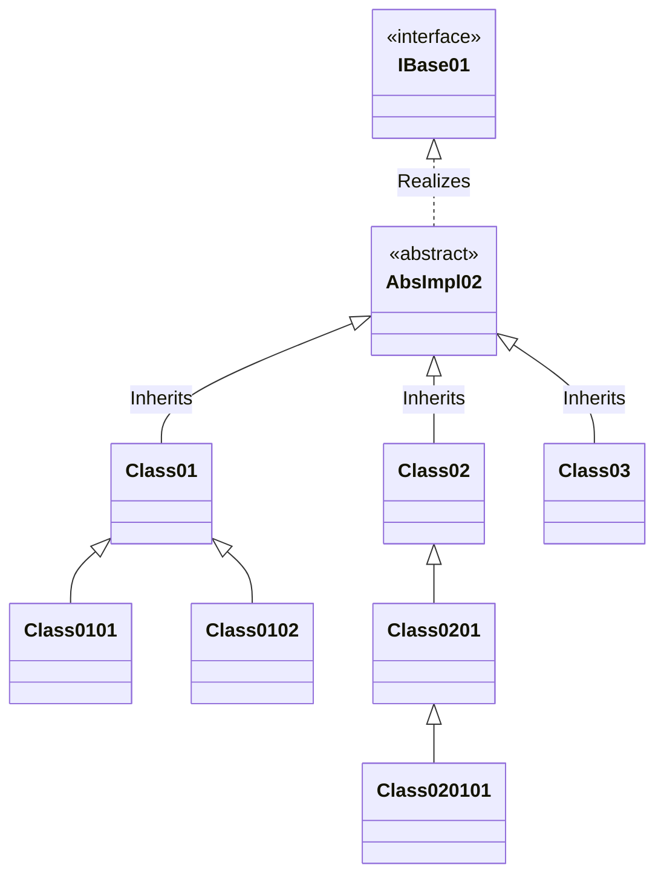

# service-locator

## General Understanding
A service locator is like a singleton in the sense that it is a centralized registry that can be used to save different types or services with instances of object.  
In simpler words, there is a dictionary which has the type and object, and whenever you want to talk to the object, you can use the dictionary to do so.

Service locators can be a singleton with `DontDestroyOnLoad()` method call to give a global scope for all users.
It can also be an instance you refer to using serialized fields or a gameManager.    
The way you reach a Service Locator is not as relevant as what you use it for.
The real benefit of Service Locator is only felt if you have been using L and D of SOLID and have too many singleton just to avoid making references in dynamic object.  
In case you forgot, here is a recap of the two.

##### Liskov Substitution Principle (L of SOLID)
"Focuses on behavior. If you have an interface, any class implementing it must act in a way that doesn't break the program if swapped"
Let us assume you have a script to get data from a server, for simplicity, let's say a API will give you a URL for privacy policy. You wrote the code for getting the URL, 
processing it, showing it in a WebView, etc. and the API is not ready. You cannot wait and leave the whole code untested until APIs are ready, you also cannot test just the URL, 
because URLs can change over time, that is the reason you are getting the URL in an API call.  

Now, you can either create a new method with dummy data and >50% of duplicated code, or you extend your classes so that a common base (interface, abstract, MonoBehaviour, etc.) 
will define all major methods, and you can substitute existing concreate code class with the dummy test class having same structure but returning hardcoded url as if it came 
from an API call. The main idea is that if you make the change from real API call to new class, your main code should not know a swap has happened, your code assumes you got 
the data from API and are working same as before. The old class structure (`Class0101`) with all API code, can be left to test the main code as needed, whereas the new code with dummy values(`Class0102`) can be used 
as needed for now.  

This is Liskov Substitution Principle (L of SOLID), "depend upon abstractions, not concretions", which means, our methods should be guidelines, 
and shall allow us to use other classes with same bases without errors. Like using a rented flat or a purchased house will both allow you to have 
a home, but a doll house will not. If I give you a "Plastic Toy Key" that fits the shape (implements IKey) but snaps in half when you turn it, 
that key has broken LSP because it didn't fulfill the behavior the door expected (can open a lock).

##### Dependency Inversion Principle (DIP) (D of SOLID)
"I will depend on the lowest level of external reference that can help me finish the work" or Focuses on *structure*. Actively choose to hold a 
reference to the Interface rather than the concreate class which implements the interface if all necessary references and calls can be done by the interface.

If a third class `Class0805` was calling or referencing `Class0101`, we still end up with errors due to API calls, so we want every other class that was using 
`Class0101` to only use `Class01`. This prevents us from calling concrete classes and keeping the logic in one place, basically, if I can use an interface as a 
reference and complete the work, I should not call the concrete class. If `Class02` satisfies all my needs, I should define my usages as `Class02` even if I am 
using object of `Class020101` ( `public Class02 classObj = new Class020101;` )    

An example of this is that if you have the class of 'key', you may open a safe, a computer, a electronic lock, anything, the key class will satisfy 'locked' to 
'unlocked' state change without worrying about the details. **The Door doesn't require a "Kwikset Model 504 Key", it requires "Anything that implements `IKey`".**    

---

### service locator
A service locator is used to get a service when we need it, we call a service locator and if a service with the desired type is available, it will return us the 
service without making us worry about the source. This is similar to a singleton instance, but here we can call services for any class that defines an interface 
by the interface and we do not need to know the class that we are using. 

#### When to use service locator
Service locator is best used, when you are trying to make modular code and know your class will have external dependency but you do not want to hard code the logic 
of external dependencies in your code modules. We can define an interface with all necessary methods and use service locator to fetch and use the methods, we do not 
know who implemented it and what is happening inside the concreate methods, but we know that all necessary modules are implemented.

For e.g., you are making a player movement logic using raycasts for "click to move" logic and you do not want to set your "changing dynamic player" to be forced to 
refer the scene camera on initialization or when a player character changes. You can make a service to tell you what camera is being used to fetch the 3D camera for 
gameplay raycasts, and then depend only on the interface and service locator to fetch the necessary details. You can also use a service to get the final position you 
want to move to, so you do not interact with the camera at all. You call a service to get the target position on mouse click, and some class out of the current module 
will calculate and give you the position, keeping your module simple and small.

#### understanding to use service locator
Let us assume you have an interface (`IBase01`) which will be implemented by an abstract class (`AbsImpl02`).
Now, we will define a few concrete classes and inherit from `AbsImpl02`.
Now, if you have to write code, you might only care about `IBase01` or `AbsImpl02` if you are using **Dependency Inversion Principle (DIP)** or 'D' in *'SOLID'* principles, but you can see the architecture below for better understanding:

I am making a module about file organization in a data heavy game modal called path data.  
I can make a interface for file read write and define the main methods in the interface and use it in my code to manage path data. (`IBase01`)  or (`AbsImpl02`)  
Someone writes a new file read write class and it realizes or implements the interface defined in my module. (`Class01`)  
Someone else may improve on previous class and add more modules while still implementing the interface (`Class02`)  
My original module wants an interface which can read and write to files, I will continue to use it, if Class02 is better, we can unregister class01 and register Class02.  
We can also change modules at runtime between Class01 and Class02 without any difference in path data, or we can change it for different platforms depending on hardware or software factors.
Either way, my module works as long as there is someone who registers a service with the interface I want to use.

#### parts of service locator in this project
There are 3 parts in my service locator implementation:
- Service Locator: This is the locator which holds data at Global level, Scene level as well as at Object level.
  - you can register or unregister a service here which you can get when needed.
- Bootstrapper: This script and all it's child classes are used to setup the Service Locator for different scopes. 
  - This allows us to keep data at different levels instead of everyone using the same service locator. 
  - Used to define at which level is the Service locator attached and what happens during scene changes.
    - Each Bootstrapper is attached to a single ServiceLocator component.
- Service Manager: Manages the use of all service locator while allowing us to register or get the necessary service locator.
  - This is a class used inside Service Locator to store and retrieve the services without any scope or data
  - This can be considered as the actual list which the service locator controls.

#### What is unique in my service locator
I did not want to use one service locator like a singleton, so there are 3 methods to get any service locator you may need based on the scope of the locator you want:  
- `GetSlGlobal()` : Fetches the only global level service locator
- `GetSlForSceneOf()` : fetches the scene level service locator 
- `GetSlForGameObjectOf()` : if the game object has a service locator for the gameobject, we can use that through this.  

Same as the above, depending on the Bootstrapper used, we have 3 classes for different level of configurations.  
You can ask to fetch service locator for your GameObject, if it does not exists, we will automatically find the one at scene level or global as needed.
You can also register based on the service locator needed, so items like music controller or player animator can be left at scene level and need not be 
created or destroyed individually.
When Getting a service locator you can ask the current GameObject level service locator, and if it fails, i will fetch it from scene or global.  
- I added a safe exit in case of infinite loop in this case

I also added `HasService()` so that you can test when there are errors when you are trying to use `Get()` instead of `TryGet()`

### Cons of Service locator
Service Locator is like duct tape on a knife cut. It helps, but it’s not a permanent fix.
- You only know that an interface or class you requested has been registered if you get a response, problem is you do not know which class is being used.
  - This can lead to uncertainty if you are using it as a singleton replacement but registering the services using interfaces.
  - My advice is if you are new, use `public void Register(Type type, object service)` instead of `public void Register<T>(T service)` as it will help track the type you register as.
- The chances of error increases a lot, 
  - if someone else has not registered a service before you want to use it, the app will throw error or crash, specially if you are changing the registered services frequently
  - if there are many services of one type, but registered at different level, e.g., 'interface' registered as well as 'ConcreteClass01' and 'ConcreteClass0102', you have to be careful which type you fetch.
    - Service locator only identifies a service by the registered type, so same service (an object of 'ConcreteClass0102' called 'obj0102') can be registered as a service for 'interface' as well as 'ConcreteClass01' and 'ConcreteClass0102' at the same time.
    - Similarly we can have objects of type 'ConcreteClass01' as 'obj0102' and also register an object of type 'ConcreteClass0102' as 'obj010201'. So knowing the class being used by type may lead to issues.
- Unclear Dependencies for classes
  - when writing a class, we use Get for services, so we do not know which class needs which module at the start. 
    - There might be possibilities of failures during operation when a module or class is 'transported' to different game or module.
- Testing Difficulties (Mocks)
  - if you write Unit test cases, for testing details, you have to initialize lot of mock services and clean them after test to avoid leaks
- Service Registration Order
  - This is something I faced even during testing, if you want to Get a service in awake, and it is also being registered in awake of another class, there might be unexpected errors.
- Runtime Errors vs. Compile-time Errors
  - If you rename a service or remove it, the compiler won't always tell you there is a problem. You only find out when the code reaches the Get<T>() call and returns `null`.

### Benefits of Service Locator
- Interface-Based Programming (Decoupling)
  - high flexibility: if I am implementing an interface, I can create new classes and change data in any way as long as my data follows the interface, no one will know or care.
    - e.g., You can swap the entire audio system (e.g., moving from Unity Audio to FMOD) without changing a single line of code in your Player or UI scripts.
- Control Over Scope
  - we can keep services in controlled scopes, so when we get the failure of fetching player health in main menu, we will use a better decoupled architecture than a singleton design.
  - This prevents "memory leaks" where objects stay in memory because a static reference is still holding onto them.
- Avoids "God Object" Syndrome
  - Service Locator is a big advocate to divide up all necessary code into interfaces and smaller classes, so we rarely have a god object(an object that does too many things).

#### How to use this package?

You can add a Bootstrapper concreate class (`ServiceLocatorGlobalBootstrapper`, `ServiceLocatorSceneBootstrapper` or `ServiceLocatorGameObjectBootstrapper`) to an empty game object and it will 
add the service locator for the desired scope.
When you initialize a service, register it based on the necessary scope
when you destroy a service, remember to unregister the service
when you need a service, make a get call and use as if you already had the service available.

Git Link: https://github.com/tglGames-Plugins/tgl-service-locator

---

References:  
1: https://github.com/adammyhre/Unity-Service-Locator  
2: https://www.youtube.com/watch?v=D4r5EyYQvwY  
3: https://www.youtube.com/watch?v=y4mn3kmxRx0

