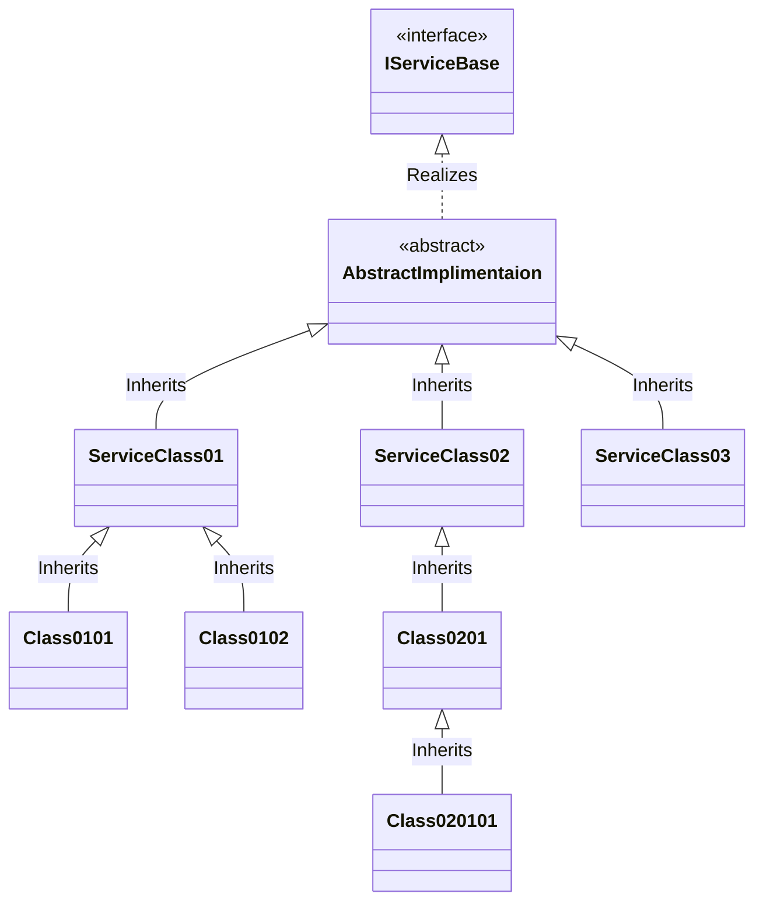

### Simplified Understanding
We have a `ServiceLocator` which is a `MonoBehaviour`, it can help us find any service that is registered with it's `ServiceManager`.

#### Configurations
Every `ServiceLocator` can have a `Bootstrapper` attached, which will call `Bootstrap()` which depending on the type of `Bootstrapper` will configure the `ServiceLocator`.
Available Configuration Methods:
- `ConfigureForGameObject()` -> `ServiceLocatorGameObjectBootstrapper`
- `ConfigureForScene()` -> `ServiceLocatorSceneBootstrapper`
- `ConfigureAsGlobal()` -> `ServiceLocatorGlobalBootstrapper`

In scene, you can just add the right type of `Bootstrapper` (MenuItem -> **GameObject**->**ServiceLocator**->**Add ...** )to which ever GameObject you want to use as a service locator, and it will configure it.
#### Types of Service Locators
There are 3 types of Service Locators:
- *Global*: There can only be one global Service locator, it finds the service we need all around the app, like user data or system configurations.
- *Scene* Level: these are unique to the scene, one scene can have Game Objects that are restricted to the scene for a service, so we can define and use them here.
- *Game Object* Level: These are service locator for situations where you are generating services and their scripts, so you want to access them in a same GameObject, so you create it. It might also be least used, but I made it, so use it if you can justify it *Wink*(Request).

#### Finding the Service Locator
If you want to get a locator to find a service, just call one of the three methods:
- `GetSlGlobal()`: Returns the existing global level service locator.
- `GetSlForSceneOf(MonoBehaviour)`: Pass any MonoBehaviour, and depending on the scene this MonoBehaviour belongs to, we can pass a service limited to the scene. If no scene level locator is fount, we return global service locator.
- `GetSlForGameObjectOf(MonoBehaviour)`: Finds the service locator attached to the same MonoBehaviour as the one passed. If no such service locator is found, we return the scene level service locator if that exists.

#### Using service with the locator

##### Registering
You can call `Register<T>(T)` or `Register(Type type, object service)` with any service that you want to register in the service locator.

Remember that in `Register<T>(T)`, *if you pass a concrete service as an interface variable, the service will be registered as the interface type*. So you can use the service with **Liskov Substitution Principle (LSP)** if you only have one implementation of the defined interface based service. Other wise if you have one interface and multiple active service with that interface, pass the concrete type in the top most level(abstract class or parent base class) where services can be differentiated in `Register(Type type, object service)`, where you define the type of registered service.

Meaning, use the type based on the level which gives you clear distinctions between services. For e.g., look at the mermaid diagram below and then look at the table:

`Register<T>` Registrations:

| S. No. | Services In Use                        | Registrations                                                                                                    |
| ------ | -------------------------------------- | ---------------------------------------------------------------------------------------------------------------- |
| 1      | ServiceClass02                         | `Register(IServiceBase variable)`                                                                                |
| 2      | Class0101, Class0102                   | `Register(Class0101 variable)` and `Register(Class0102 variable)`                                                |
| 3      | Class0101, Class020101, ServiceClass03 | `Register(ServiceClass01 variable)`, `Register(ServiceClass02 variable)` and `Register(ServiceClass03 variable)` |
If this feels hard, we can always use `Register(Type type, object service)`:

| S. No. | Services In Use                        | Registrations                                                                                                                                                                      |
| ------ | -------------------------------------- | ---------------------------------------------------------------------------------------------------------------------------------------------------------------------------------- |
| 1      | ServiceClass02                         | `Register(typeof(IServiceBase), IServiceBase variable)`                                                                                                                            |
| 2      | Class0101, Class0102                   | `Register(typeof(Class0101), IServiceBase variable)` and `Register(typeof(Class0102), IServiceBase variable)`                                                                      |
| 3      | Class0101, Class020101, ServiceClass03 | `Register(typeof(ServiceClass01), IServiceBase variable)`, `Register(typeof(ServiceClass02), IServiceBase variable)` and `Register(typeof(ServiceClass03), IServiceBase variable)` |
Here, the variable datatype does not matter as we are passing distinction in the type parameter.

**Un-Registering**
To un-register, call `void UnRegister<T>(T service)` or `void UnRegister(Type type)`

##### Get the registered Service
We have a `void Get<T>(out T service)` method and a `bool TryGet<T>(out T service)` method to either get a registered service or to find if we can get a service of passed type.

##### verify the Service is registered
To validate if we have a registered service of a defined type, use `bool HasService<T>()`.

##### Debugging the registered Services
If you are unable to understand what service is not working, you can always run `PrintAllRegisteredServices()` and it will print all services registered with it's type for debugging.
